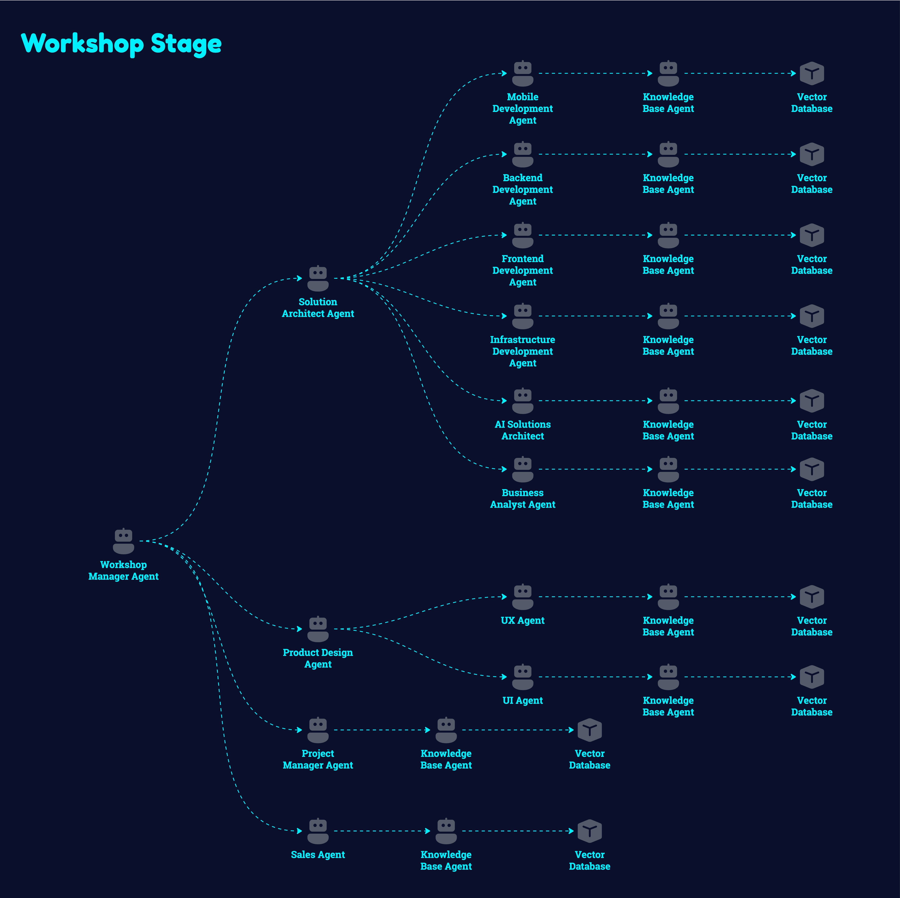
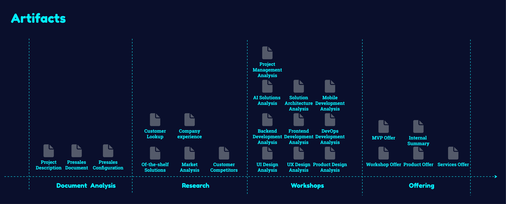

# Modular Agentic AI Architecture

**A flexible, multi-agent system for automating the presales process using Google's Agent Development Kit**

## Table of Contents
1. [Introduction](#introduction)
   - 1.1 [Motivation](#motivation)
   - 1.2 [Project Description](#project-description)
   - 1.3 [Give a Star](#give-a-star)
   - 1.4 [Share It](#share-it)
   - 1.5 [Contributing](#contributing)
   - 1.6 [Roadmap](#roadmap)
2. [Architecture Overview](#architecture-overview)
   - 2.1 [High Level Architecture](#high-level-architecture)
   - 2.2 [Code Structure](#code-structure)
   - 2.3 [Project in Numbers](#project-in-numbers)
   - 2.4 [Technologies Used](#technologies-used)
   - 2.5 [Repositories](#repositories)
3. [Running the System](#running-the-system)
4. [Components](#components)
5. [A2A Agent](#a2a-agent)
6. [Knowledge Base RAG](#knowledge-base-rag)
7. [Presales Workflow](#presales-workflow)
   - 7.1 [Workflow Stages](#presales-workflow-stages)
   - 7.2 [Presales Artifacts](#presales-artifacts)
8. [FireCrawl MCP](#firecrawl-mcp)
9. [Prompting Techniques](#prompting-techniques)
10. [Conclusions](#conclusions)
    - 10.1 [Google ADK Production Readiness](#google-adk-production-readiness)
    - 10.2 [On a Personal Note](#on-a-personal-note)
11. [License](#license)

---

## Introduction

### Motivation

The landscape of AI development is rapidly evolving from single-purpose models to interconnected agent systems capable of handling complex workflows. This project was born from a desire to explore how these emerging agent frameworks could transform knowledge-intensive business processes like the presales workflow in software development.

Traditional approaches to automating such processes have been limited by the difficulty of encoding domain expertise and the challenge of maintaining coherence across multiple specialized tasks. With the advent of sophisticated agent frameworks like Google's ADK, we now have the opportunity to create systems that can intelligently delegate, collaborate, and synthesize information in ways that more closely resemble human expert teams.

### Project Description

This project represents an experimental implementation of a modular agent architecture using Google's Agent Development Kit (ADK). It was designed to evaluate and stress-test ADK's capabilities in a practical, complex business context - specifically, the presales process for software development projects.

The system demonstrates how specialized AI agents can collaborate to automate knowledge work that traditionally requires multiple human experts. By breaking down the presales workflow into discrete stages and specialized roles, the architecture showcases the potential for multi-agent systems to handle complex, multifaceted business processes.

Key objectives of this project include:
- Evaluating ADK's ability to coordinate multiple specialized agents
- Testing different agent communication patterns (sequential, parallel, hierarchical)
- Exploring techniques for maintaining context across agent boundaries
- Assessing the effectiveness of role-based prompting for specialized tasks
- Developing patterns for shared artifact creation and knowledge transfer
- Creating a realistic proof-of-concept for AI augmentation of knowledge work
- Testing the Agent2Agent (A2A) protocol for agent communication
- Testing the Model Context Protocol (MCP) for tool integration

The architecture serves as a practical test bed for emerging AI agent techniques while simultaneously providing value through automation of presales activities. This dual purpose has informed design decisions throughout, balancing experimental exploration with practical utility.

**Note:** This implementation is intended as a research and exploration project and is not production-ready. Key findings, limitations, and recommendations for production implementations will be addressed in a separate Conclusions section.

This project assumes familiarity with several advanced AI concepts and emerging technologies:
* **Agentic AI** - Autonomous AI systems that can make decisions and take actions on behalf of users
* **Agent2Agent Protocol** - Standards and methods for AI agents to communicate and collaborate
* **Model Context Protocol** - Methods for managing and transferring context between different AI model instances
* **Retrieval-Augmented Generation (RAG)** - Techniques for enhancing LLM outputs with retrieved information
* **Large Language Model (LLM) Tools** - The use of tools by LLMs to extend their capabilities into the real world
* **Hierarchical Agent Networks** - Structures for organizing agents in supervisory relationships
* **Multi-modal Agent Systems** - Agents that can process and generate multiple types of data (text, images, etc.)

### Give a Star

If you find this project useful or interesting, please consider giving it a star on GitHub. Your stars help make this project more visible to others who might benefit from it.

### Share It

Share this project with colleagues and friends who are interested in AI agent systems, presales automation, or modular AI architectures. Spreading the word helps build a community around these emerging technologies.

### Contributing

Contributions to this project are welcome! Here are some ways you can contribute:

- **Bug Reports**: If you find a bug, please open an issue with detailed steps to reproduce.
- **Feature Requests**: Have ideas for new features? Open an issue to discuss them.
- **Code Contributions**: Want to add features or fix bugs yourself? Fork the repository, make your changes, and submit a pull request.
- **Documentation**: Help improve the documentation by fixing errors or adding clarifications.
- **Use Cases**: Share how you've used or adapted this architecture for your own projects.

### Roadmap

This project is still evolving, and several key improvements are planned for future development:

1. **Logging Enhancements**: Implement a comprehensive logging system across all components to provide better visibility into system operations and simplify debugging.

2. **Observability Framework**: Add metrics, tracing, and monitoring capabilities to enable production-grade observability of the agent ecosystem.

3. **Agent Testing & Evaluation**: Develop systematic testing and evaluation frameworks to measure agent performance, reliability, and effectiveness across different scenarios.

We welcome contributions in any of these areas! If you're interested in tackling one of these roadmap items, please open an issue to discuss your approach before submitting code. This helps ensure your contribution aligns with the project's direction and avoids duplication of effort.

---

## Architecture Overview

### High Level Architecture
The following diagram illustrates the detailed architecture of the modular agent system, showing how the various components interact:

This architecture follows a modular design pattern where specialized agents communicate through standardized interfaces, allowing for flexible composition and extension of the system.

### Code Structure
The project is organized as a monorepo containing multiple interconnected components:

This monorepo approach enables coordinated development across all components while still maintaining clear boundaries between different modules.

### Project in Numbers
Key metrics about the project's scope and implementation:

These metrics demonstrate the scale and complexity of the system, highlighting the extensive use of specialized agents and prompts to create a comprehensive presales automation solution.

### Technologies Used
The project leverages various Python libraries across its components:

| Application | Key Libraries |
|-------------|---------------|
| **Knowledge Base RAG** | LangChain, ChromaDB, OpenAI, Pydantic, Google ADK |
| **FireCrawl MCP** | FastMCP, Pydantic, Pydantic-Settings, Python-Dotenv, FireCrawl API |
| **Presales Workflow** | Google ADK, Pydantic, Python-Dotenv, Google A2A SDK (`https://github.com/google-a2a/a2a-python`) |
| **Infrastructure** | Poetry (dependency management), Uvicorn (server), Black/Pylint/Isort (formatting) |

This technology stack was selected to provide a balance between development speed, maintainability, and performance across all components.

### Repositories

#### Official Repository Links
The project builds upon several official repositories and frameworks:

- **Google Agent Development Kit (ADK)**: https://github.com/google/adk-python
- **Agent2Agent Protocol (A2A)**: https://github.com/google/A2A
- **Google A2A SDK for Python**: https://github.com/google-a2a/a2a-python
- **Model Context Protocol (MCP)**: https://github.com/modelcontextprotocol
- **FastMCP**: https://github.com/jlowin/fastmcp

#### Projects Worth Observing
These community projects provide additional resources and examples for A2A and MCP implementations:

- **Awesome A2A Resources**: https://github.com/ai-boost/awesome-a2a  
- **A2A Projects Collection**: https://github.com/pab1it0/awesome-a2a 
- **Awesome MCP Servers**: https://github.com/punkpeye/awesome-mcp-servers
- **MCP Server Implementations**: https://github.com/appcypher/awesome-mcp-servers 
- **Python A2A Implementation**: https://github.com/themanojdesai/python-a2a

---

## Running the System

To run the complete system, please follow the setup and running instructions in the README files of the three main components:

- [FireCrawl MCP README](firecrawl_mcp/README.md)
- [Knowledge Base RAG README](knowledge_base_rag/README.md)
- [Presales Workflow README](presales_workflow/README.md)

Each component has specific prerequisites, environment configurations, and startup procedures that need to be followed for proper operation of the integrated system.

---

## Components

| Component | Folder | Description |
|-----------|--------|-------------|
| **Knowledge Base RAG** | `knowledge_base_rag` | Retrieval-Augmented Generation agent that stores and provides information about company experience and previous projects. |
| **FireCrawl MCP** | `firecrawl_mcp` | Web scraping microservice that extracts and formats web content for use by other agents in the system. |
| **Presales Workflow** | `presales_workflow` | End-to-end workflow orchestrator that manages the presales process through multiple specialized sub-agents. |

---

## A2A Agent Communication

Effective agent-to-agent (A2A) communication is a cornerstone of this modular architecture. The project now leverages the official **Google A2A SDK for Python** (`https://github.com/google-a2a/a2a-python`) to facilitate seamless interaction and coordination between specialized agents.

**Business Purpose:**
- Enables robust and standardized communication between distributed AI agents.
- Facilitates the creation of complex workflows by allowing agents to delegate tasks and exchange information.
- Promotes modularity and reusability of agent capabilities.
- Ensures interoperability within the broader A2A ecosystem.

**Technical Integration:**
- The official `a2a-python` SDK is integrated into the relevant components (e.g., Presales Workflow, Knowledge Base RAG) to handle A2A interactions.
- This replaces the previous custom A2A implementation, bringing the project in line with official Google standards for agent communication.
- Agents utilize the SDK to register their skills and discover and invoke skills offered by other agents.
- Communication relies on the standardized A2A protocol, ensuring compatibility and future-proofing the architecture.

By adopting the official Google A2A SDK, the project benefits from ongoing developments in the A2A standard, community support, and a more robust and maintainable communication infrastructure.

---

## Knowledge Base RAG

The Knowledge Base RAG component functions as the organizational memory system within the architecture, leveraging Retrieval-Augmented Generation to provide factual information about company experience and previous projects.

**Business Purpose:**
- Provides access to institutional knowledge about past projects and company capabilities
- Ensures consistent and accurate information across all presales activities
- Reduces reliance on individual team members' memories or scattered documentation
- Supports presales activities with verifiable evidence of expertise and experience

**Technical Implementation:**
- Built using Google's Agent Development Kit (ADK) for core agent functionality
- Utilizes ChromaDB as a vector store for efficient semantic search
- Implements document chunking and embedding for optimal information retrieval
- Offers dual functionality:
  - **Search**: Retrieves relevant information based on semantic similarity
  - **Import**: Allows adding new project information to the knowledge base
- Maintains strict factuality by only responding with information found in the knowledge base
- Exposes functionality through both a web interface and an A2A (Agent-to-Agent) server

This component serves as an essential source of truth for the presales workflow, enabling other agents to ground their analyses and recommendations in the company's actual experience and capabilities.

---

## Presales Workflow

The Presales Workflow component orchestrates the end-to-end process of analyzing client requirements, conducting research, designing solutions, and creating tailored offers through a coordinated system of specialized agents.

**Business Purpose:**
- Streamlines and standardizes the presales process for software development projects
- Reduces the time and effort required to create high-quality proposals
- Ensures comprehensive analysis across multiple technical disciplines
- Maintains consistency in approach and quality across different presales opportunities
- Captures and leverages organizational knowledge and best practices

**Technical Implementation:**
- Implements a sophisticated multi-agent architecture using Google's Agent Development Kit
- Organizes workflow into four sequential stages: Document Analysis, Research, Workshop, and Offering
- Utilizes both sequential and parallel agent execution patterns:
  - **Sequential Agents**: Coordinating the overall workflow stages
  - **Parallel Agents**: Handling specialized analyses simultaneously (e.g., frontend, backend, UX)
- Maintains state through structured artifacts passed between agents
- Integrates with external services:
  - Knowledge Base RAG for company experience information
  - Web search capabilities for market and competitor research
- Implements 14 specialized sub-agents covering diverse aspects of solution design:
  - Technical domains (Backend, Frontend, Mobile, DevOps)
  - Design aspects (Product, UX, UI)
  - Project management and solution architecture
  - Specialized areas (AI Solutions)

This component represents the core business process automation in the architecture, demonstrating how multiple specialized agents can collaborate effectively to tackle complex knowledge work that traditionally requires input from multiple human experts.

### Presales Workflow Stages

#### 1. Document Analysis Stage

The initial stage where customer documents and requirements are analyzed to extract project specifications and business context.

#### 2. Research Stage

Comprehensive research on market conditions, competitors, and existing solutions to provide context for the proposal.

#### 3. Workshop Stage

Specialized technical agents working in parallel to analyze requirements and design solutions from different perspectives.

#### 4. Offering Stage

Creation of tailored offers based on insights from previous stages, resulting in comprehensive and competitive proposals.

### Presales Artifacts

The structured documents produced throughout the presales process. These artifacts capture key information at each stage and are passed between agents, ensuring comprehensive knowledge transfer and maintaining context throughout the workflow.

---

## FireCrawl MCP

The FireCrawl MCP component provides web scraping capabilities to the agent ecosystem, enabling the extraction and transformation of web content into structured, machine-readable formats that can be utilized by other agents.

**Business Purpose:**
- Enhances research capabilities by efficiently gathering information from the web
- Provides access to current market data, competitor information, and technology trends
- Reduces manual effort in collecting and formatting web content
- Enables data-driven decision making with up-to-date external information
- Supports more comprehensive and well-informed presales proposals

**Technical Implementation:**
- Built using the Model Context Protocol (MCP) framework
- Integrates with the FireCrawl web scraping library to handle the technical aspects of web content extraction
- Exposes a single focused tool:
  - **scrape_url**: Extracts content from a specified URL and returns it in Markdown format
- Implements error handling and status reporting to manage failed scraping attempts
- Uses Pydantic models for robust input/output type validation
- Configurable through environment variables for API keys and server settings
- Designed as a lightweight microservice that can be deployed independently

This component serves as a specialized utility within the architecture, providing essential external data gathering capabilities to support the research phase of the presales workflow. Its integration demonstrates how focused, single-purpose microservices can be effectively incorporated into a larger agent-based system.

---

## Prompting Techniques

This project demonstrates several advanced prompting techniques to optimize AI agent performance and coordination:

### Role-Based Prompting
- **Persona Definition**: Each agent has a clearly defined professional role (e.g., "Strategic Market Intelligence Analyst," "Backend Developer") that focuses its expertise and response style.
- **Domain Specialization**: Prompts describe specific domain knowledge and responsibilities for each agent role.
- **Professional Voice**: Roles establish an appropriate voice and tone for specialized business contexts.

### Process-Oriented Prompting
- **Step-by-Step Instructions**: Prompts provide clear, numbered workflows that guide agent reasoning through complex tasks.
- **Decision Trees**: Key prompts include conditional logic (if/then structures) to support proper decision-making.
- **Explicit Artifact Handling**: Detailed instructions for retrieving, processing, and generating artifacts.

### Tool-Use Directives
- **Tool Selection Guidance**: Prompts explicitly specify which tools to use at each step of a process.
- **Input/Output Formatting**: Clear instructions on how to parse inputs and format outputs for each tool.
- **Error Handling Patterns**: Guidance for handling common tool-use failures and edge cases.

### System Architecture Knowledge
- **Cross-Agent Awareness**: Prompts include information about other components in the ecosystem.
- **Artifact Passing Protocol**: Standardized naming and formats for artifacts shared between agents.
- **Interface Contracts**: Clear definitions of expected inputs/outputs between system components.

### Output Structuring
- **Template References**: Prompts reference specific output templates to ensure consistent formatting.
- **Format Specifications**: Detailed requirements for artifact structure and content.
- **Naming Conventions**: Standardized artifact naming patterns ensure discoverability.

These techniques collectively enable a complex, multi-agent system to function coherently while maintaining separation of concerns and specialization of individual components.

---

## Conclusions

This section will contain key findings, limitations, and recommendations based on the implementation and testing of this modular agent architecture. It will address production readiness considerations, identified challenges, and potential improvements for future implementations.

### Google ADK Production Readiness

After implementing and thoroughly testing this modular agent architecture using Google's Agent Development Kit (ADK), several key findings have emerged regarding its production readiness:

#### Strengths

1. **Agent Orchestration**: ADK demonstrates strong capabilities in orchestrating multiple specialized agents, successfully enabling both sequential and parallel execution patterns crucial for complex workflows.

2. **Tool Integration**: The framework provides a robust mechanism for tool definition and usage, allowing agents to interact effectively with external systems and data sources.

3. **Prompt Management**: The system handles prompt engineering effectively, maintaining consistency across numerous specialized agents with different roles and responsibilities.

4. **Context Management**: ADK's artifact system shows promise in maintaining state between agent interactions, though with some limitations noted below.

#### Limitations

1. **Error Handling**: The current implementation of ADK lacks sophisticated error propagation and recovery mechanisms, particularly in parallel agent execution contexts. Production systems would require additional error handling layers.

2. **Documentation Gaps**: Several advanced features required significant trial and error to implement correctly, highlighting gaps in documentation for complex use cases.

3. **Development Tooling**: Debugging capabilities are limited, making it challenging to troubleshoot complex agent interactions, especially when tools fail or return unexpected results.

4. **Production Monitoring**: The framework lacks built-in observability features necessary for production monitoring, requiring custom implementation of logging, metrics, and tracing.

5. **Limited Long-Running Task Support**: The current task manager is memory-resident, which introduces reliability and scalability concerns for long-running processes. A more robust implementation with persistence and state management would be necessary for production scenarios.

#### Recommendations for Production Deployment

Based on these findings, Google ADK shows promise but is not yet fully production-ready for mission-critical applications. Organizations considering ADK for production should:

1. Implement comprehensive error handling and fallback mechanisms
2. Develop custom monitoring and observability solutions
3. Consider a phased deployment approach, starting with non-critical workloads
4. Maintain human oversight for important decisions and outputs
5. Design agent systems with graceful degradation capabilities
6. Thoroughly test under realistic load conditions before deployment

The technology demonstrates significant potential for transforming knowledge work, but requires additional engineering investment to reach production-grade reliability. For organizations willing to contribute engineering resources to address these gaps, ADK can serve as a solid foundation for building sophisticated agent systems, particularly in domains like the presales process demonstrated in this project.

### On a Personal Note

Working on this modular agent architecture has been an enlightening journey into the frontier of AI agent systems. A few personal observations worth sharing:

Personally, I'm quite impressed with the direction Google's ADK is taking. Its approach to agent architecture aligns well with the practical needs of complex AI systems. A significant advantage is Google's backing and their ownership of the Agent2Agent protocol, which provides some assurance of continued development and standardization. While the framework isn't yet production-ready, I'm hopeful that the project will continue to evolve and mature into a robust solution for enterprise applications.

We are at a pivotal moment in technological history, witnessing the formation of tomorrow's foundational technologies. These agent systems represent not just incremental improvements to existing software paradigms, but potentially a fundamental shift in how we build and interact with intelligent systems. The architectural patterns and integration approaches we establish today may well become the standard practices for the next generation of AI systems.

---

## License

This project is licensed under a Restricted Use License that allows for educational and research use while prohibiting commercial use without explicit permission. See the [LICENSE](LICENSE) file for details.

For commercial licensing inquiries, please contact: konrad.jarzyna0@gmail.com
